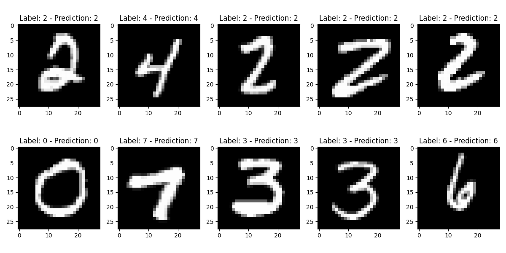

### Goal
```text
使用PyTorch建立一个用于图像分类的简单神经网络。首先加载了MNIST数据集，进而定义了神经网络的架构。
然后，使用训练数据对模型进行了训练，并评估了它在测试数据上的表现
```


导入库
```python
# nn（用于定义神经网络层）
# optim（用于定义优化算法）
# datasets和transforms（用于加载和处理数据）
import torch
import torch.nn as nn
import torch.optim as optim
import torch.nn.functional as F
from torch.utils.data import DataLoader
import torchvision.datasets as datasets
import torchvision.transforms as transforms
```
创建神经网络
```python
# nn.Module类定义了一个全连接的神经网络（也被称为前馈神经网络-FFN）
# (feed-forward layer (前馈层)(feed-forward network)
class NeuralNetwork(nn.Module):
    def __init__(self, input_size, num_classes):
        super(NeuralNetwork, self).__init__()
        # 定义了两个全连接层
        # 将输入特征的维度从input_size降维到50，因此有50个隐藏单元
        self.fc1 = nn.Linear(in_features=input_size, out_features=50)
        # 在这里，50是由上一层的输出决定的，
        # 而num_classes通常是指分类问题中的类别数量。
        # 这意味着fc2层将上一层的输出（大小为50）映射到一个大小为num_classes的输出空间
        self.fc2 = nn.Linear(in_features=50, out_features=num_classes)
        
    # 定义了神经网络的前向传播过程
    def forward(self, x):
        return self.fc2(F.relu(self.fc1(x)))
```
检查一下上面的类
```python
model = NeuralNetwork(784, 10)
x = torch.rand(64,784)
print(model(x).shape)
# torch.Size([64, 10])
```
设备设置
```python
device = torch.device('cuda' if torch.cuda.is_available() else 'cpu')
```
设置超参数
```python
# 定义了一个学习率0.001，一个批量大小64，并训练了10个epochs。
input_size = 784  # 输入特征维度
num_classes = 10  # 输出类别
learning_rate = 0.001  # 学习率
batch_size = 64  # 批次大小
num_epochs = 10  # 迭代次数
```
加载数据
```python
# 数据自动下载
train_data = datasets.MNIST(root = "dataset/", 
                            train=True, 
                            transform=transforms.ToTensor(), 
                            download=True
                            )

train_loader = DataLoader(dataset=train_data, 
                          batch_size=batch_size, 
                          shuffle=True
                          )

test_data = datasets.MNIST(root = "dataset/", 
                           train=False, 
                           transform=transforms.ToTensor(), 
                           download=True
                           )

test_loader = DataLoader(dataset=test_data, 
                         batch_size=batch_size, 
                         shuffle=True
                         )
```
初始化网络
```python
# 使用.to()方法在设备上初始化我们的神经网络模型
model = NeuralNetwork(input_size=input_size, num_classes=num_classes).to(device)
```
定义损失和优化器
```python
# 定义交叉熵损失函数
criterion = nn.CrossEntropyLoss()
# PyTorch提供的Adam优化器
# 优化器是一种工具，用来帮助我们更新模型的参数，以使损失函数最小化
optimizer = optim.Adam(params= model.parameters(), lr=learning_rate)
# optim.SGD()
```
训练模型
```python
# 已经定义了我们的模型，加载了数据，并初始化了必要的组件
# 我们的目标是最小化损失函数，这样模型的预测结果就会更接近真实标签。
# 通过分批迭代训练数据来训练我们的神经网络，并使用反向传播更新模型参数
# 反向传播是一种用于训练模型的优化算法。
# 它通过计算损失函数对模型参数的梯度，并利用这些梯度来更新模型参数，以使损失函数最小化
for epoch in range(num_epochs):
    for batch_idx, (data, labels) in enumerate(train_loader):
        data = data.to(device=device)
        labels = labels.to(device=device)
        data = data.reshape(data.shape[0], -1)
        
        # forward 函数体现 
        # 在每个训练批次中，通过将数据传递给模型，调用了模型的 forward 方法。
        # 这样做会执行神经网络的前向传播过程
        scores = model(data)
        
        loss = criterion(scores, labels)
        optimizer.zero_grad()
        
        # 这两行代码执行了反向传播(Backpropagation)的关键步骤
        # 梯度是损失函数对模型参数的变化率，或者说是损失函数关于模型参数的导数
        # 计算了损失函数对模型参数的梯度。将计算得到的梯度存储在模型的参数的.grad属性中
        loss.backward()
        # 根据损失函数的梯度来更新模型的参数
        # 优化器会根据规则Adam,以及损失函数的梯度，对模型的参数进行更新，使得损失函数的值减小
        optimizer.step()
```
评估模型
```python
num_correct = 0
num_samples = 0
model.eval()

with torch.no_grad():
    for data, labels in test_loader:
        data = data.to(device=device)
        labels = labels.to(device=device)

        data = data.reshape(data.shape[0],-1)

        scores = model(data)

        _, predictions = torch.max(scores, dim=1)
        num_correct += (predictions == labels).sum()
        num_samples += predictions.size(0)

    print(f'Got {num_correct} / {num_samples} with accuracy {float(num_correct) / float(num_samples)*100:.2f}')

model.train()
# Got 9714 / 10000 with accuracy 97.14
```
可视化
```python
import matplotlib.pyplot as plt

# 测试并绘制10张随机图像
model.eval()
with torch.no_grad():
    fig, axs = plt.subplots(2, 5, figsize=(12, 6))
    axs = axs.flatten()

    for i, (data, labels) in enumerate(test_loader):
        if i >= 10:  # Break after 10 images
            break

        data = data.to(device=device)
        labels = labels.to(device=device)

        data = data.reshape(data.shape[0], -1)

        scores = model(data)

        _, predictions = torch.max(scores, dim=1)

        # 绘制图像和预测结果
        img = data.cpu().numpy().reshape(-1, 28, 28)
        axs[i].imshow(img[0], cmap='gray')
        axs[i].set_title(f"Label: {labels[0]} - Prediction: {predictions[0]}")
    plt.tight_layout()
    plt.show()
    
model.train()
```


### Reference(参考文档)
* [PyTorch搭建神经网络](https://zhuanlan.zhihu.com/p/631263095)
* [paddle&tensorflow](https://github.com/aceliuchanghong/large_scale_models_learning_log/blob/main/my_llm_article/paddle%26tensorflow.md)
