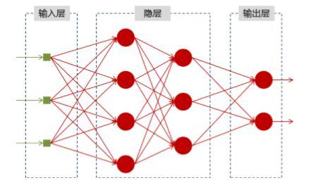
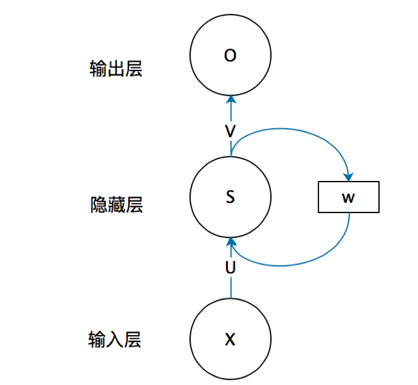
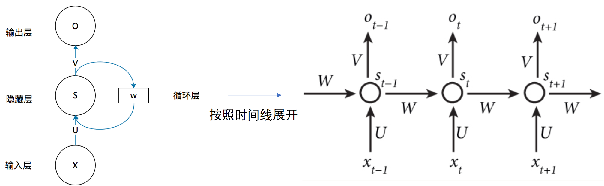
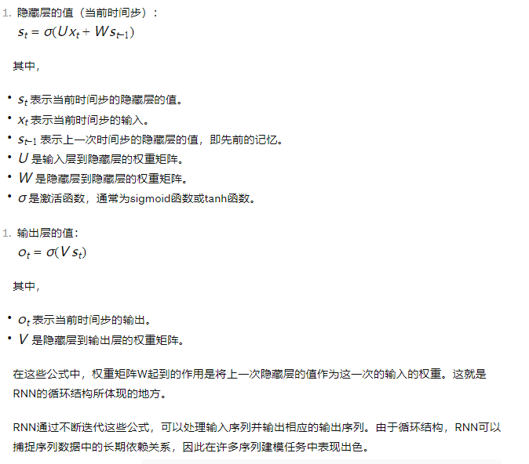
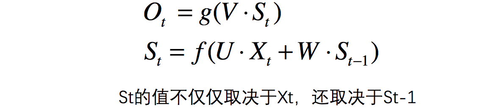

### 神经网络
神经网络可以当做是能够拟合任意函数的黑盒子，只要训练数据足够，给定特定的x，就能得到希望的y，结构图如下：



### Why need RNN?

```text
之前的只能单独的取处理一个个的输入，前一个输入和后一个输入是完全没有关系的。
但是，某些任务需要能够更好的处理序列的信息，即前面的输入和后面的输入是有关系的。

比如，当我们在理解一句话意思时，孤立的理解这句话的每个词是不够的，我们需要处理这些词连接起来的整个序列； 
当我们处理视频的时候，我们也不能只单独的去分析每一帧，而要分析这些帧连接起来的整个序列。
```

### RNN循环神经网络（Recurrent Neural Network）

```text
RNN的基本结构由一个循环单元组成，该单元通过一个循环连接，使得信息可以在序列中传递。
在每个时间步，循环单元接收输入和来自上一个时间步的隐藏状态，并产生输出和传递给下一个时间步的隐藏状态。

输入层、一个隐藏层和一个输出层组成

RNN的工作原理:
前向传播：在RNN中，输入数据序列逐步被送入网络中。
在每个时间步，网络会根据当前输入和前一个时间步的隐藏状态计算输出和当前时间步的隐藏状态。

反向传播：RNN的训练过程涉及前向传播和反向传播。
前向传播用来计算模型的输出，而反向传播用来计算梯度并更新模型参数，以使其能够更好地拟合训练数据。

RNN的问题与改进:
梯度消失/爆炸：长期依赖问题是RNN面临的主要挑战之一。在训练过程中，梯度可能会变得非常小或非常大，导致训练不稳定。
为了解决这个问题，可以使用一些改进的RNN结构，如长短期记忆网络（LSTM）和门控循环单元（GRU）。

并行性限制：由于循环结构，RNN在处理序列数据时难以并行化。
为了提高计算效率，可以使用一些变种结构，如带有注意力机制的RNN或Transformer等。
```



也可以转化为:



```text
x是一个向量，它表示输入层的值
s是一个向量，它表示隐藏层的值
U是输入层到隐藏层的权重矩阵
o也是一个向量，它表示输出层的值
V是隐藏层到输出层的权重矩阵
W:循环神经网络的隐藏层的值s不仅仅取决于当前这次的输入x，还取决于上一次隐藏层的值s。
权重矩阵W就是隐藏层上一次的值作为这一次的输入的权重。
```

#### RNN的基本公式






### Reference(参考文档)

* [RNN理解](https://zhuanlan.zhihu.com/p/30844905)
