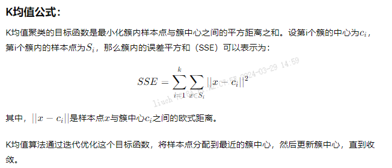
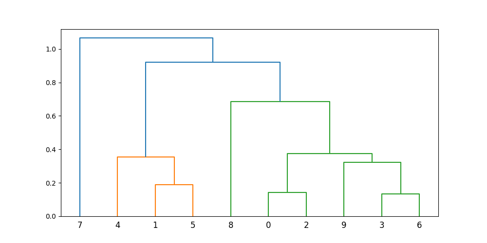
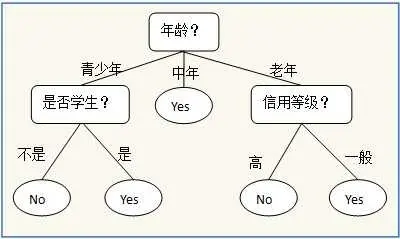
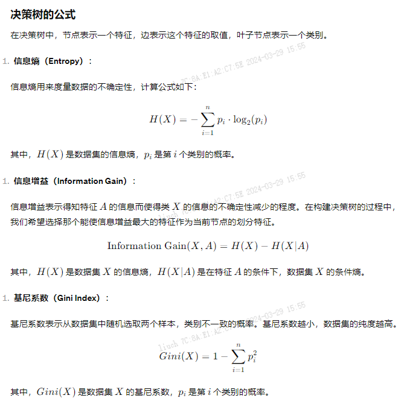
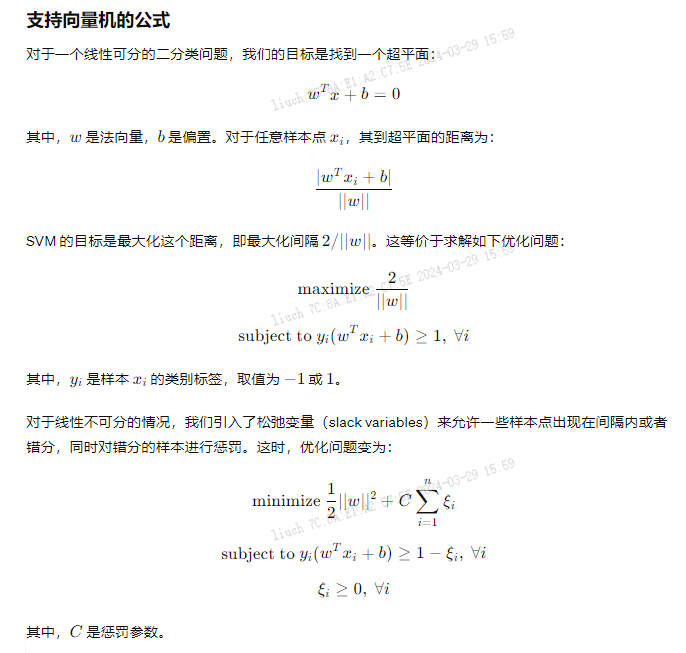
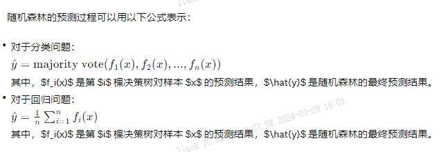

## 画像分类
```text
画像分类的关键算法通常包括以下几种：

聚类算法：如K均值聚类、层次聚类等。这些算法能够将用户数据按照特征相似性进行分组，从而生成不同的用户群体，用于构建用户画像。

分类算法：包括决策树、支持向量机、随机森林等。这些算法可以根据已有的用户数据和标签，建立分类模型，用于预测新用户的分类。
```

### 聚类

1. K均值聚类
```text
K-means 是我们最常用的基于欧式距离的聚类算法，其认为两个目标的距离越近，相似度越大。

K均值（K-means）聚类是一种常用的聚类算法，用于将数据分成K个不同的簇。
该算法的基本思想是将数据集中的样本点划分为K个簇，使得每个样本点都属于距离最近的簇中心，
同时最小化簇内的误差平方和（SSE，Sum of Squared Error）。

算法步骤：
初始化：随机选择K个样本作为初始的簇中心。
分配样本：将每个样本分配给距离最近的簇中心。
更新簇中心：重新计算每个簇的中心，将中心移动到簇内所有样本的平均值处。
迭代：重复步骤2和步骤3，直到簇中心不再发生变化或达到最大迭代次数。

有四个牧师去郊区布道，一开始牧师们随意选了几个布道点，并且把这几个布道点的情况公告给了郊区所有的村民，于是每个村民到离自己家最近的布道点去听课。
听课之后，大家觉得距离太远了，于是每个牧师统计了一下自己的课上所有的村民的地址，搬到了所有地址的中心地带，并且在海报上更新了自己的布道点的位置。
牧师每一次移动不可能离所有人都更近，有的人发现A牧师移动以后自己还不如去B牧师处听课更近，于是每个村民又去了离自己最近的布道点……
就这样，牧师每个礼拜更新自己的位置，村民根据自己的情况选择布道点，最终稳定了下来。

2.1 优点
容易理解，聚类效果不错，虽然是局部最优， 但往往局部最优就够了；
处理大数据集的时候，该算法可以保证较好的伸缩性；
当簇近似高斯分布的时候，效果非常不错；
算法复杂度低。
2.2 缺点
K 值需要人为设定，不同 K 值得到的结果不一样；
对初始的簇中心敏感，不同选取方式会得到不同结果；
对异常值敏感；
样本只能归为一类，不适合多分类任务；
不适合太离散的分类、样本类别不平衡的分类、非凸形状的分类。
```



```python
# 实例 pip install scikit-learn
from sklearn.cluster import KMeans
import numpy as np
# 创建示例数据
X = np.array([[1, 2], [1, 4], [1, 0], [4, 2], [4, 4], [4, 0]])
# 定义K值
k = 2
# 初始化K均值聚类模型
kmeans = KMeans(n_clusters=k)
# 使用模型拟合数据
kmeans.fit(X)
# 输出簇中心
print("Cluster centers:", kmeans.cluster_centers_)
# 预测样本所属的簇
print("Cluster predictions:", kmeans.labels_)
```
2. 层次聚类

```text
层次聚类是一种基于距离的聚类方法，它通过计算数据点之间的距离来构建一个层次结构，然后根据这个层次结构划分数据点到不同的类别中。
在层次聚类中，不需要事先指定聚类的数量，它会自动构建出一个层次化的聚类结构。
常见的层次聚类算法包括凝聚式聚类和分裂式聚类。

凝聚式聚类是最常见的层次聚类方法之一。
它的基本思想是将每个数据点看作是一个单独的类别，然后通过合并最接近的两个类别来逐步构建聚类结构，
直到所有数据点都合并到一个类别中为止。合并的过程会形成一棵树状的层次结构，称为聚类树或者树状图。

层次聚类的公式通常基于距离度量，常用的距离度量包括
欧式距离、曼哈顿距离、闵可夫斯基距离等。
凝聚式聚类的合并过程通常使用
最小距离法(single-linkage clustering),最大距离法(complete-linkage clustering),平均距离法(average-linkage clustering)等方法
```

```python
# 使用 scipy 库中的 hierarchical clustering 方法进行层次聚类
import numpy as np
from scipy.cluster.hierarchy import dendrogram, linkage
import matplotlib.pyplot as plt
# 生成示例数据
np.random.seed(0)
# X 是一个包含 10 个数据点的二维数组，每一行代表一个数据点，每个数据点有两个特征
X = np.random.rand(10, 2)
# 计算距离矩阵 并使用“ward”方法进行聚类
Z = linkage(X, 'ward')
# 绘制聚类树
plt.figure(figsize=(10, 5))
dendrogram(Z)
plt.show()
```


### 分类

1. 决策树
```text
决策树（decision tree）是一个树结构，可以是二叉树或非二叉树，
也可以把他看作是 if-else 规则的集合，也可以认为是在特征空间上的条件概率分布。
决策树的创建是根据给定的训练数据来完成的

香农提出“信息熵”的概念。一条信息的信息量大小和它的不确定性有直接的关系，
要搞清楚一件不确定的事，需要了解大量信息。
熵(entropy)用于表示 随机变量不确定性的度量, 如果熵越大，表示不确定性越大。
```




2. 支持向量机(Support Vector Machine，SVM)
```text
是一种强大的监督学习算法，用于分类和回归问题。
它的基本思想是找到一个最优的超平面来对数据进行分类，使得两个不同类别的样本点距离超平面的间隔最大化。
```



3. 随机森林
```text
随机森林（Random Forest）是一种集成学习方法，
通过构建多个决策树并结合它们的预测结果来进行分类或回归。
它的基本思想是通过对训练集的随机抽样和特征的随机选择来构建多个决策树，
然后通过投票或平均来获得最终的预测结果，从而提高模型的泛化能力和稳定性。

基本决策树：
随机森林的基础是决策树。决策树根据输入数据的特征进行分割，直到达到停止条件为止。
每个叶节点代表一个类别或者一个数值。
随机性：
随机特征选择：在构建每棵决策树时，随机选择一部分特征来训练决策树。
这种方法有助于减少特征之间的相关性，增加模型的多样性。
随机样本选择：对于每棵树的训练集，通过自助采样（bootstrap sampling）从原始数据中随机选择样本。
这样有助于使每个基学习器都在不同的数据子集上训练，增加模型的多样性。
集成：
随机森林通过集成多个决策树来提高模型的预测性能。
对于分类问题，采用投票机制，对每个样本的预测结果进行多数投票；
对于回归问题，采用平均法，对每个样本的预测结果进行平均。
```



### Reference

* [KMeans介绍](https://zhuanlan.zhihu.com/p/78798251)
* [层次聚类方法](https://zhuanlan.zhihu.com/p/34168766)
* [决策树](https://zhuanlan.zhihu.com/p/31691985)
* [支持向量机]()
* [随机森林]()
