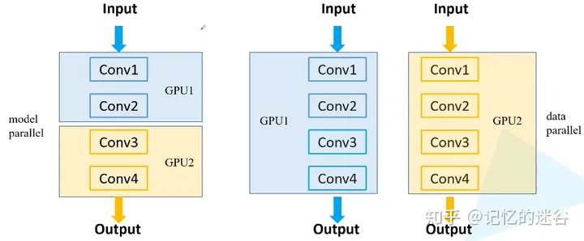
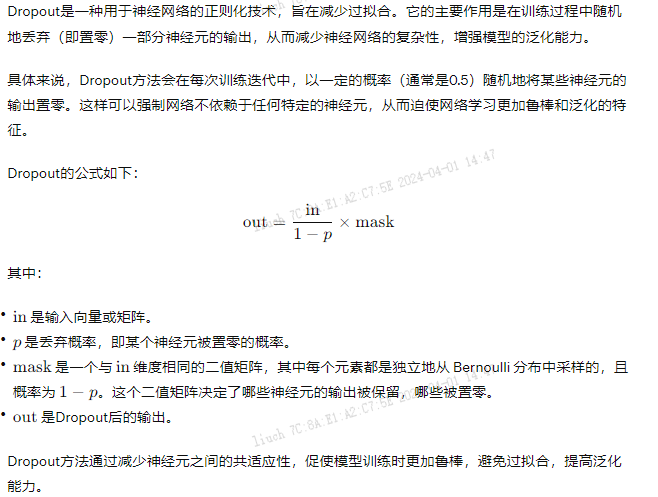
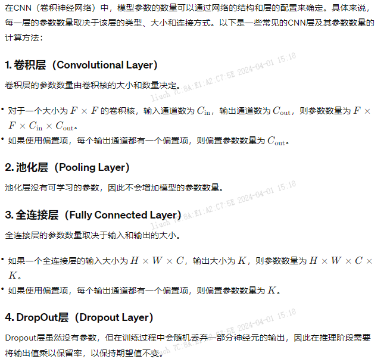

太难了,md

```text
1.什么是zero-shot, one-shot和few-shot Learning
2.如何多卡并行
3.如何优化减少多卡并行的损失率
4.transfomer模型理论,注意力公式,什么叫注意力,mutil-head
5.比如CNN这种调的时候超参数是哪些?
6.如何评估模型
7.如何减少过拟合,怎么判断
8.模型微调的时候数据格式,采集数据等应该怎么处理好
9.训练过哪些模型,微调细节
10.模型到底要有多少参数,要有多少有效数据
11.大模型要训练多久,在有限ops的时候如何做到效果最好
```

算法题目:

```text
给定一个数组比如[1,1,2,3,5] 一个target值7,输出所有的加起来等于target的子数组,使用dfs解决
```

[testPdd.py](../using_files/test/testPdd.py)

### 20240401问题解析:

1. zero-shot

```text
Zero-shot 、One-shot 、Few-shot Learning策略主要是用于解决神经网络模型因为训练数据少，导致模型泛化能力差的问题。
Zero-shot Learning:
    在训练集中没有某个类别的样本，但是在测试集中出现了这个类别，
    那么我们就需要模型在训练过程中，即使没有接触过这个类别的样本，
    但是仍然可以通过对于这个类别的描述，对没见过的类别进行分类，
    目的是让模型对于要分类的样本一次也不学习的同时具有人类的推理能力。
    
    假设我们的模型已经能够识别马，老虎和熊猫了，现在需要该模型也识别斑马，
    那么我们需要告诉模型，怎样的对象才是斑马，但是并不能直接让模型看见斑马。
    所以模型需要知道的信息是马的样本、老虎的样本、熊猫的样本和样本的标签，
    以及关于前三种动物和斑马的描述。
Few-shot Learning:
    在模型训练过程中，如果每个类别只有少量样本（一个或者几个），
    研究人员希望机器学习模型在学习了一定类别的大量数据后，
    对于新的类别，只需要少量的样本就能快速学习，这就是 Few-shot Learning 要解决的问题。
    few-shot learning是meta-learning的一种，本质上是让机器学会自己学习（learn to learn），
    其实就是通过判断测试样本与训练样本的相似性，来推测测试样本属于什么类。
    学习的目的是理解事物之间的不同，学会区分不同事物。给两张图像，不让学会是什么，而是学会是否相同。
    比如：给小孩子看一张熊猫的照片，那么小孩子到动物园看见熊猫的照片之后，就可以识别出那是熊猫。
One-shot Learning是Few-shot Learning的一种特殊情况
```

2. 如何多卡并行

```text
有点像分布式系统,或者Yarn
常见的多GPU训练方法：
1.模型并行方式：如果模型特别大，GPU显存不够，无法将一个显存放在GPU上，需要把网络的不同模块放在不同GPU上，这样可以训练比较大的网络。（下图左半部分）

2.数据并行方式：将整个模型放在一块GPU里，再复制到每一块GPU上，同时进行正向传播和反向误差传播。相当于加大了batch_size。（下图右半部分）

且随着使用GPU数量越多，设备之间的通讯会越来越复杂，所以随着GPU数量的增加，训练速度的提升也是递减的。

误差梯度如何在不同设备之间通信？
在每个GPU训练step结束后，将每块GPU的损失梯度求平均，而不是每块GPU各计算各的。
```



```text
两种GPU训练方法：DataParallel和DistributedDataParallel：
DataParallel是单进程多线程的，仅仅能工作在单机中。而DistributedDataParallel是多进程的，可以工作在单机或多机器中。
DataParallel通常会慢于DistributedDataParallel。所以目前主流的方法是DistributedDataParallel。
```

```python
# 使用 torch.distributed.launch 运行多进程
# 这个文件保存为 train.py

import torch
import torch.distributed as dist
import torch.multiprocessing as mp
from torch.nn.parallel import DistributedDataParallel as DDP
import os


def main(rank, world_size):
    # 初始化进程组
    dist.init_process_group("gloo", rank=rank, world_size=world_size)

    # 构建模型和优化器
    model = torch.nn.Linear(10, 5).to(rank)
    ddp_model = DDP(model, device_ids=[rank])

    loss_fn = torch.nn.MSELoss()
    optimizer = torch.optim.SGD(ddp_model.parameters(), lr=0.001)

    # 训练循环
    for epoch in range(10):
        optimizer.zero_grad()
        outputs = ddp_model(torch.randn(20, 10).to(rank))
        labels = torch.randn(20, 5).to(rank)
        loss = loss_fn(outputs, labels)
        loss.backward()
        optimizer.step()

        print(f"Rank {rank}, epoch {epoch}, loss {loss.item()}")

    # 清理
    dist.destroy_process_group()


if __name__ == "__main__":
    # 设置环境变量
    os.environ['MASTER_ADDR'] = 'localhost'
    os.environ['MASTER_PORT'] = '12355'
    world_size = 2

    # 启动多个进程
    mp.spawn(main, args=(world_size,), nprocs=world_size)
```

```shell
python -m torch.distributed.launch --nproc_per_node=2 train.py
```

3. 如何优化减少多卡并行的损失率
```text
主要就是通信上的一些时间损失
最简单的方法可以减少数据通信的次数
    噢~ 这个通信是指不同计算机之间的吗?
累计一部分梯度后一起回传,不同的卡
    哦,累计一部分梯度,但是梯度不是参数变化率吗?这也能累计?
卡与卡之间通信是要时间的,你可以前向传播4次再反向传播一次,期间梯度都累加,相当于变相提升batchsize
    哦.但是这儿有个问题了.你前向传播4次,你没有计算损失函数,万一某一次是最好了,那不就错过了
不会的,那按照你的说法，batch_size大了不是一样吗,这种体量的模型不会这么敏感的
理论上我们想要全面用到服务器的数据都希望batchsize很大
因为能吃满显存,理论上是要快一点
```

5. CNN相关超参数调优

```text
# 简单的超参数
# 定义了一个学习率0.001，一个批量大小64，并训练了10个epochs。
input_size = 784  # 输入特征维度
num_classes = 10  # 输出类别
learning_rate = 0.001  # 学习率
batch_size = 64  # 批次大小
num_epochs = 10  # 迭代次数
激活函数
Dropout
正则化系数
```

```python
# 激活函数
import torch
import torch.nn as nn


# 定义一个简单的CNN模型
class SimpleCNN(nn.Module):
    def __init__(self):
        super(SimpleCNN, self).__init__()
        self.conv1 = nn.Conv2d(3, 32, kernel_size=3, stride=1, padding=1)
        self.relu = nn.ReLU()  # 这里使用ReLU作为激活函数
        # 常见的激活函数有ReLU、Sigmoid、Tanh等。
        # 如果你想尝试其他激活函数，只需将nn.ReLU()替换为其他激活函数即可。

    def forward(self, x):
        x = self.conv1(x)
        x = self.relu(x)  # 使用ReLU激活函数
        return x


# 创建模型实例
model = SimpleCNN()

```

```python
# Dropout
import torch
import torch.nn as nn


# 定义一个简单的CNN模型
# 通过添加nn.Dropout(p=0.5)来应用Dropout方法，并将丢弃概率设置为0.5。通过调整p参数来改变丢弃的比例。
class SimpleCNN(nn.Module):
    def __init__(self):
        super(SimpleCNN, self).__init__()
        self.conv1 = nn.Conv2d(3, 32, kernel_size=3, stride=1, padding=1)
        self.relu = nn.ReLU()
        self.dropout = nn.Dropout(p=0.5)  # 添加一个Dropout层，丢弃概率为0.5

    def forward(self, x):
        x = self.conv1(x)
        x = self.relu(x)
        x = self.dropout(x)  # 使用Dropout
        return x


# 创建模型实例
model = SimpleCNN()
```

Dropout到底有什么作用,有什么意义,公式呢?



```python
# 调整正则化系数调优,搜索最佳的dropout概率
# 使用Grid Search方法来调优正则化系数的示例代码：
# 在这个案例中，模型的训练和调参是通过GridSearchCV对象自动完成的
import torch
import torch.nn as nn
from sklearn.model_selection import GridSearchCV
from sklearn.datasets import make_classification
from sklearn.model_selection import train_test_split
from sklearn.metrics import accuracy_score


# 构建一个简单的PyTorch模型
class SimpleNN(nn.Module):
    def __init__(self, input_size, hidden_size, output_size, dropout_p):
        super(SimpleNN, self).__init__()
        self.fc1 = nn.Linear(input_size, hidden_size)
        self.relu = nn.ReLU()
        self.dropout = nn.Dropout(p=dropout_p)
        self.fc2 = nn.Linear(hidden_size, output_size)

    def forward(self, x):
        x = self.fc1(x)
        x = self.relu(x)
        x = self.dropout(x)
        x = self.fc2(x)
        return x


# 创建一个样本数据集
X, y = make_classification(n_samples=1000, n_features=20, n_classes=2, random_state=42)

# 将数据集划分为训练集和验证集
X_train, X_val, y_train, y_val = train_test_split(X, y, test_size=0.2, random_state=42)

# 定义网格搜索的超参数范围
param_grid = {'dropout_p': [0.1, 0.2, 0.3, 0.4, 0.5]}

# 创建模型实例
model = SimpleNN(input_size=20, hidden_size=32, output_size=2, dropout_p=0.5)

# 使用网格搜索交叉验证来搜索最佳的正则化系数
# 并使用Grid Search交叉验证方法来搜索最佳的dropout概率
grid_search = GridSearchCV(estimator=model, param_grid=param_grid, cv=5)

# 在训练集上拟合模型
# 整个训练和调参的过程是在GridSearchCV对象的fit方法中完成的
grid_search.fit(X_train, y_train)

# 打印最佳参数和最佳分数
print("Best Parameter: ", grid_search.best_params_)
print("Best Score: ", grid_search.best_score_)

# 使用最佳参数的模型在验证集上进行评估
best_model = grid_search.best_estimator_
y_pred = best_model.predict(X_val)
accuracy = accuracy_score(y_val, y_pred)
print("Validation Accuracy with Best Model: ", accuracy)
```

7. 减少过拟合

```text
1. 数据集处理
增加数据量: 更多的数据可以帮助模型更好地学习到数据的分布，减少过拟合的风险。
数据扩增: 通过对训练数据进行旋转、缩放、平移、翻转等变换，增加数据的多样性，从而减少过拟合。
2. 模型复杂度
简化模型: 减少模型的层数、参数数量，选择合适的模型结构，以降低模型的复杂度，减少过拟合的可能性。
正则化: 添加正则化项（如L1、L2正则化）到损失函数中，限制模型参数的大小，防止过度拟合。
3. Dropout
使用Dropout方法来随机丢弃一部分神经元的输出，减少神经网络的复杂性，防止神经元共适应，从而减少过拟合。
4. 交叉验证
使用交叉验证来评估模型的性能，并及时发现过拟合的情况。通过交叉验证可以更好地估计模型的泛化能力。
5. 监控指标
监控训练集和验证集上的损失值、准确率等指标，观察模型在不同数据集上的表现。如果训练集上的性能远远好于验证集，可能存在过拟合现象。
6. 早停
当模型在验证集上的性能不再提升或开始下降时，可以停止训练，以避免过拟合。
7. 参数调优
调整模型超参数（如学习率、批量大小、正则化系数等），以找到最优的模型配置，从而减少过拟合的风险。
```

9. 微调细节看: 2.大模型优化技术/fine_tune/

* [LLM_Fine_Tuning.ipynb](../2.%B4%F3%C4%A3%D0%CD%D3%C5%BB%AF%BC%BC%CA%F5/fine_tune/LLM_Fine_Tuning.ipynb)

10. 模型到底要有多少参数,要有多少有效数据,这种怎么考虑呢?

```text
确定模型参数的数量和所需的有效数据量是建立一个有效的机器学习模型时的重要考虑因素。以下是一些考虑因素：

1. 模型参数数量
模型复杂度: 模型的参数数量通常与模型的复杂度相关。更复杂的模型通常具有更多的参数。在设计模型时，需要权衡模型的复杂度和泛化能力。
数据集大小: 数据集的大小也会影响模型参数的数量。通常来说，当数据集较大时，模型可以更复杂，具有更多的参数。
问题的复杂性: 解决复杂问题可能需要更复杂的模型，从而需要更多的参数。但是，过度复杂的模型可能会导致过拟合。
2. 有效数据量
模型复杂度: 更复杂的模型通常需要更多的数据来训练，以防止过拟合。当模型复杂度增加时，所需的有效数据量也会增加。
数据的多样性: 数据集中的样本多样性也会影响所需的有效数据量。如果数据样本具有高度相关性，可能需要更多的数据来覆盖更多的情况。
数据噪声: 如果数据集中存在噪声，通常需要更多的数据来帮助模型区分信号和噪声。
3. 考虑因素
交叉验证: 使用交叉验证来评估模型性能，并确定所需的有效数据量。通过交叉验证可以更好地估计模型的泛化能力。
模型评估: 在训练和评估模型时，要注意模型在训练集和验证集上的性能差异。如果模型在验证集上的性能较差，可能是由于训练数据不足导致的过拟合。
```

```python
import torch
import torch.nn as nn


# 定义一个简单的CNN模型
class SimpleCNN(nn.Module):
    def __init__(self):
        super(SimpleCNN, self).__init__()
        self.conv1 = nn.Conv2d(3, 32, kernel_size=3, stride=1, padding=1)
        self.conv2 = nn.Conv2d(32, 64, kernel_size=3, stride=1, padding=1)
        self.fc1 = nn.Linear(64 * 8 * 8, 128)
        self.fc2 = nn.Linear(128, 10)

    def forward(self, x):
        x = self.conv1(x)
        x = self.conv2(x)
        x = nn.functional.max_pool2d(x, 2)
        x = torch.flatten(x, 1)
        x = self.fc1(x)
        x = self.fc2(x)
        return x


# 创建模型实例
model = SimpleCNN()
# 打印模型的参数数量
total_params = sum(p.numel() for p in model.parameters())
print("Total Parameters: ", total_params)
# Total Parameters:  545098
```


### Reference

* [zero-shot](https://blog.csdn.net/zcyzcyjava/article/details/127006287)
* [YARN 分布式资源调度](https://zhuanlan.zhihu.com/p/28640358)
* [LLMs多卡并行](https://zhuanlan.zhihu.com/p/402198819)
